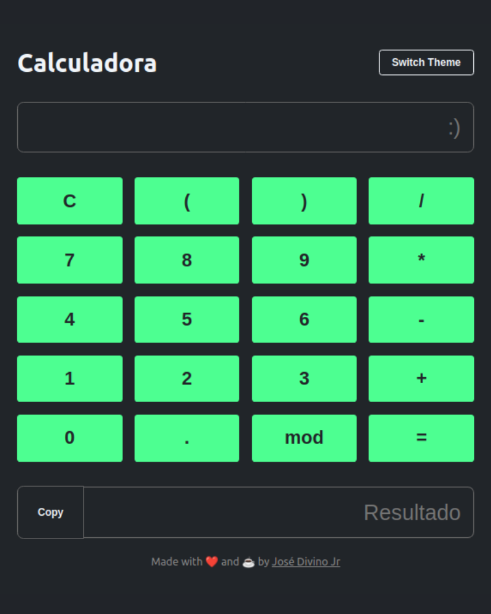

# Calculator

## Introduction
Calculator is a simple web application that allows users to perform basic mathematical calculations. It provides a user-friendly interface and supports both light and dark themes.

## Features
- Responsive design that works well on different devices.
- Switchable theme between light and dark modes.
- Input field to enter mathematical expressions.
- Calculation of expressions using basic arithmetic operations.
- Copy-to-clipboard functionality to easily share results.
- Made with HTML, CSS, and JavaScript.  

## Preview

## Live Demo
You can try out the calculator by visiting the [live demo](https://lustrous-twilight-6675dc.netlify.app/).

## Contributing
Contributions are welcome! If you have any ideas, suggestions, or bug reports, please open an issue or submit a pull request.

## Acknowledgements
- The design of this calculator were inspired by the FullStackJS course by OneBitCode.
- The [Math.js](https://mathjs.org/) library is used for mathematical calculations.

## Contact
For any inquiries or questions, feel free to contact me at josedivinofjr@gmail.com.

